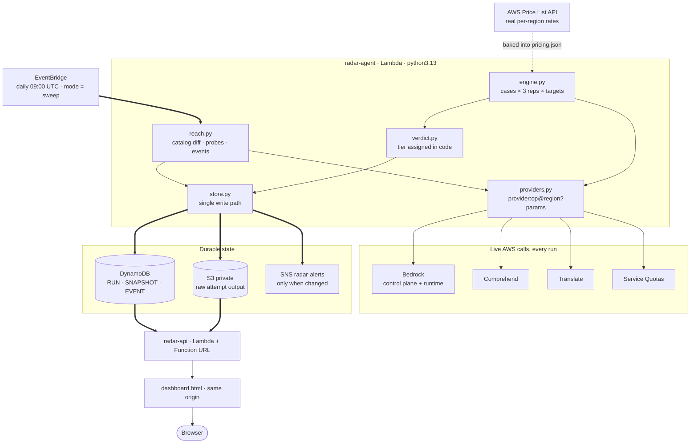

# Weekend Showcase Challenge: Model Drift Radar

**Tags:** #application

**Live dashboard:** https://m4lvje4llsqr6q72k5zqkx5roe0kfqpr.lambda-url.us-east-1.on.aws/
**Repo:** https://github.com/harshendram/aws-weekend-challenge2

---

## The vision, and the bug that caused it

I started the weekend planning to build a model evaluation harness. Twenty
minutes in, the harness told me something I did not want to hear: **every
Bedrock model in my account, in every region, was returning
`ValidationException: Operation not allowed`.**

I assumed I had broken something. I hadn't. All 151 on-demand inference quotas
on the account read `0` and were marked non-adjustable — which is not a rate
limit you wait out. It means the account is not entitled to Bedrock inference
at all.

Then I checked the agent I shipped for an earlier weekend challenge, a thing
that wakes up daily and generates a frame of a film. It was still running.
Still green. Still writing output. And every single invocation had been failing
its model call and falling back to a hand-written non-AI code path. It had been
degrading for days. Nothing alerted, because *"my dependency is still callable"*
is not a metric anybody emits.

That reframed the whole project. Model drift is usually told as a story about
quality: the model changes, your prompts quietly stop working. That story is
real. But the **duller failure is worse and far more common** — the model is
still in the docs, still in the catalog, still in your config, and your account
can no longer call it.

So the vision for **Model Drift Radar** is narrow and, I think, honest: *an
unattended agent should not be the last to know that its own dependencies
changed.* The radar watches both halves — can I still call it, and does it still
behave — and it tells you only when the answer changed.


*The live dashboard. `NO INFERENCE` is not a rendering bug — that is the radar
correctly reporting that this AWS account cannot call Bedrock at all, while
Comprehend and Translate answer fine. This is exactly the state that was
silently breaking my other agent.*

## What it does

**Reachability.** Every day it diffs the Bedrock catalog across four regions,
then probes every dependency with a one-token call and records whether it
answered. It compares that against the previous scan and raises events —
`ACCESS_LOST`, `MODEL_ADDED`, `MODEL_REMOVED`, `ENTITLEMENT_CHANGED`,
`PRICE_CHANGED` — publishing to SNS **only when something actually changed**. A
daily "all clear" email is a daily "ignore me" email.

The probe is deliberately the authority. The catalog will happily list models
you are not entitled to invoke, and the Service Quotas API is slow and
occasionally returns `408`. The only answer that cannot be argued with is an
actual call.

**Behaviour.** A contract is a JSON file: some inputs, and the properties the
output must hold. The radar replays it across every target, three times each,
and grades the result into tiers — `SWITCH`, `SAFE`, `BASELINE`, `RISKY`,
`FAIL`, `ERROR`.


*One unattended sweep, end to end: scan, diff against yesterday, then replay
every behaviour contract. Note the `alt` block — silence is a deliberate
output, not a missing feature.*

## How I built it, the decisions, and the pivot

The original design was Bedrock-only. When Bedrock inference turned out to be
unavailable, I had roughly a day, so the fix had to be structural rather than
cosmetic.

I introduced a **target grammar**:

```
provider ":" op [ "@" region ] [ "?" k=v & k=v ]

bedrock:us.amazon.nova-lite-v1:0     foundation model, via Converse
comprehend:redact@ap-south-1         managed PII redaction, in Mumbai
comprehend:pii?min=0.99              same service, stricter threshold
translate:fr?back=en                 translate out, and back again
```

The trick that made the pivot cheap: **every provider normalises its answer to
text**, emitting JSON wherever the service returns structure. The assertion
library never learns that providers exist. My existing `pii-redaction` contract,
written for a foundation model, ran unchanged against Amazon Comprehend the
moment the provider existed — because both hand back plain redacted text.

That turned a dead end into a better product. The radar now compares the *same*
managed service across regions and confidence thresholds, which is the knob
teams actually turn in production, usually without measuring what it costs them.

Two decisions I would defend in a review:

**Tiers are assigned by code, never by a model.** A model is allowed to
*rewrite* the explanation more fluently, and only if one is reachable. Letting
an LLM grade the migration would rest the tool's central claim on the exact
thing it exists to test. My account proved the point: with zero generative
models available, the radar is still fully useful.

**Flakiness is graded separately from failure.** A check that never passes is
broken and you will notice within a day. A check that passes two times in three
survives every manual spot-check you will ever run, then fails in production.
Averaging those into one pass rate destroys the most valuable signal the tool
produces, so a sometimes-passing check is `RISKY` on its own.


*The whole grader. It is a decision tree in plain Python — no model sits
anywhere on this path.*

The hardest part was resisting the urge to fake it. Pricing comes from the live
AWS Price List API, per region, for all three services. If a target cannot be
priced, its cost is `None` — never `0`, never a guess, because an unknown cost
silently read as free produces confidently wrong migration advice.

One bug worth confessing: my price fetcher was silently dropping
`DetectSentiment`. My exclusion regex filtered usage types containing `time`, to
skip training and endpoint dimensions. `DetectSen`**`time`**`nt` matched. It cost
me twenty minutes and is now anchored on hyphenated suffixes.

## What it actually found

These are live results, not hypotheticals:

- **Comprehend classifies `14:32` as `DATE_TIME` at 0.9998 confidence, in every
  region.** A log-scrubbing pipeline that redacts everything Comprehend detects
  will silently destroy the timestamps in its own operational logs.
- **Raising the PII confidence threshold makes redaction worse.** At
  `min=0.999` the detector falls from 24/27 checks to 18/27 and lands in `FAIL`
  — it stops finding real emails and card numbers. The intuitive "be stricter to
  be safer" knob trades a small precision gain for a much larger recall loss.
- **The same managed model is 15× faster in one region than another.** Sentiment
  classification: `ap-south-1` p50 **106 ms** vs `us-east-1` p50 **1571 ms**,
  identical requests, identical published price.
- **Translation cost depends on the target language.** A Japanese round trip
  bills `$1.50` per 1k calls against `$2.17` for German, because Translate bills
  per character and languages are not equally dense.


*The stricter-threshold result, measured rather than assumed. Same service, same
inputs, same price — `min=0.999` drops to 18/27 and is the only row that fails
outright. The amber banner is the tool admitting its own baseline is imperfect,
which felt more useful than hiding it.*

## AWS services used, and the architecture

**Lambda, DynamoDB, S3, EventBridge, SNS, IAM, Bedrock** (control plane and
runtime), **Amazon Comprehend, Amazon Translate, Service Quotas**, and the
**AWS Price List API**.




*Two Lambdas and no build system. `providers.py` is the seam that let the whole
thing survive losing Bedrock.*

No SAM, no CDK, no bootstrap stack — `infra/deploy.sh` is idempotent and uses
nothing but the AWS CLI. The dashboard HTML is served from the same Lambda that
serves the JSON, which means one origin, no CORS, no public bucket, and no
CloudFront propagation wait. The single write path is guarded by a shared
secret, so a public URL can never spend my money. Everything sits inside Free
Tier: one scheduled invocation a day, on-demand DynamoDB, and a handful of
Comprehend and Translate calls.

## What I learned across the summer

June taught me to ship something small and actually finish it. July taught me
that a creative app lives or dies on its *constraints*, not its cleverness.
August's autonomous agent taught me the thing that produced this project: **an
agent that runs unattended will fail unattended too, and it will do it quietly.**

The deeper lesson landed this weekend. I had been treating "the model works" as
a static fact established once at build time. It is not a fact, it is a
*measurement*, and measurements go stale. Access is revocable. Prices move.
Managed models are updated underneath you. Regional endpoints disagree by 15×.
None of that shows up in an error-rate graph, because nothing errors — something
else just quietly answers instead.

I also learned to build the escape hatch before I need it. The provider
abstraction that rescued this project took about an hour, and only because the
assertion layer had no idea what a model was. Loose coupling stopped being a
principle I nod along to and became the reason I had a submission at all.

## The builder who inspired me

**@simi** — she writes constantly, and her articles read like *dev notes* rather
than polished write-ups. That is the part I keep coming back to. She writes
while building instead of after, so the wrong turns are still in there: the
error she actually hit, the thing she tried that didn't work, the reason she
changed approach. Most technical writing sands all of that off and leaves you a
clean narrative you cannot learn from, because it hides the only part you were
going to get stuck on too.

Her posts got me unstuck more than once this summer, and they changed how I
wrote *this* one. My first draft opened with the finished architecture and never
mentioned that Bedrock was dead on my account. I rewrote it to lead with the
failure, kept the `DetectSen`**`time`**`nt` regex bug in, and left the amber
"your baseline is broken" banner visible in the screenshot instead of cropping
it out. That is a direct steal from how she writes. Thank you, @simi — please
keep publishing the messy middle.

## Try it

- **Live dashboard:** https://m4lvje4llsqr6q72k5zqkx5roe0kfqpr.lambda-url.us-east-1.on.aws/
- **Source:** https://github.com/harshendram/aws-weekend-challenge2

Clone it, run `python scripts/selftest.py` to see the grader work with no AWS
account at all, then `bash infra/deploy.sh` to put it in your own.

---

*Built for the AWS Builder Center Weekend Showcase Challenge, August 2026.*
